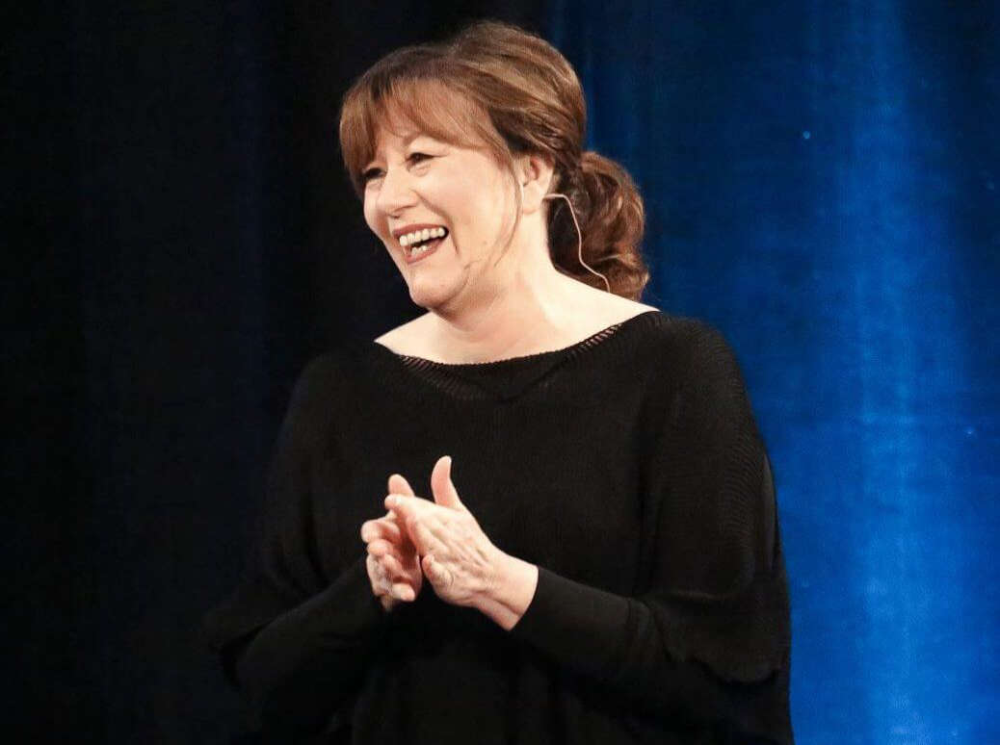

---
meta:
  - name: description
    content: Abraham Hicks česky - přehled základních informací a konceptů Abraham Hicks
---

# Abraham Hicks

## Kdo je Abraham Hicks?

Abraham je jméno, symbol, pocit. Kdo nebo co ale Abraham tedy ve skutečnosti je? Louise Hay je nazvala "jedněmi z nejlepších současných učitelů na Zemi". Obecně jsou uznávaní (je to kolektiv) pro svou moudrost, kterou nám sdělují přes svůj kanál - Esther Hicks. Sami sebe Abraham nazývají "kolektivní vědomí z nefyzické dimenze". Svými slovy jsou tím, čím jsme i my - všichni jsme na samém okraji Stvoření. Esther je nazývá "nekonečnou inteligencí", její zesnulý manžel Jerry pak "nejčistší formou lásky, kterou kdy poznal.

[Abraham Hicks česky - překlady](https://www.bennu.cz/ucitele/abraham-hicks/)

## :book: Knihy

- [Požádej a je ti dáno](https://www.martinus.cz/?uItem=75974&z=IFPM3I&utm_source=z%3DIFPM3I&utm_medium=url&utm_campaign=partner)
- [Sára - Kniha první](https://www.martinus.cz/?uItem=79884&z=IFPM3I&utm_source=z%3DIFPM3I&utm_medium=url&utm_campaign=partner)
- [Sára - Kniha druhá](https://www.martinus.cz/?uItem=141802&z=IFPM3I&utm_source=z%3DIFPM3I&utm_medium=url&utm_campaign=partner)
- [Sára - Kniha třetí](https://www.martinus.cz/?uItem=159535&z=IFPM3I&utm_source=z%3DIFPM3I&utm_medium=url&utm_campaign=partner)

## :headphones: Audioknihy

- [Požádej a je ti dáno (MP3 ke stažení)](https://www.martinus.cz/?uItem=256974&z=IFPM3I&utm_source=z%3DIFPM3I&utm_medium=url&utm_campaign=partner)
- [Požádej a je ti dáno (MP3 na CD)](https://www.martinus.cz/?uItem=261538&z=IFPM3I&utm_source=z%3DIFPM3I&utm_medium=url&utm_campaign=partner)
- [Sára - Kniha první (MP3 ke stažení)](https://www.martinus.cz/?uItem=256713&z=IFPM3I&utm_source=z%3DIFPM3I&utm_medium=url&utm_campaign=partner)
- [Sára - Kniha první (MP3 na CD)](https://www.martinus.cz/?uItem=214172&z=&utm_source=z%3D&utm_medium=&utm_campaign=partner)

## Jste fyzickým prodloužením nefyzického

Všeho-co-je nebo to, co nazýváte Bohem, není hotové a dokonalé a nečeká jen na vás, až k tomu také dojdete. Nacházíte se na čelní linii myšlenky, hledající zde něco více. Více všeho, co považujete za dobré, více toho, co je nové, čerstvé a úžasně povznášející. (Vy ve své podstatě přinášíte nebe na zemi.)

## Jste v tomto těle, protože jste si to vybrali

Vybrali jste si zažívat tento lahodný kontrast v tomto čase a prostoru. S velkým očekáváním jste přišli spolutvořit s dalšími bytostmi hledajícími radost a potěšení, jemně doladit proces záměrných myšlenek. (Co, kde, kdy a s kým tvoříte jsou také vaše volby.)

## Podstatou vašeho života je svoboda a naplněním je radost

Máte svobodu objevovat nové cesty k vaší radosti. S ní porostete; a jak budete růst, tak budete přispívat i k růstu i Všeho, co jest.
(Můžete si ovšem volit také svázanost a bolest. Cokoli si ale volíte, je to jen proto, že si myslíte, že se pak bude cítit lépe.)

## Jste tvůrci; Tvoříte každou svou myšlenkou

Díky vesmírnému zákonu přitažlivosti přitahujete podstatu čehokoliv, čemu se rozhodnete věnovat pozornost – ať je to chtěné nebo nechtěné. Většinou tvoříte náhodně a nevědomě. Podle svých emocí ale můžete poznat, jestli to, co přitahujete, vytváříte. (Kam je zaměřená vaše pozornost?)

## Cokoliv si dokážete představit, tím můžete být, mít to, nebo to dělat

Když se ptáte sami sebe, proč to chcete, tak se aktivuje podstata vaší touhy, a Vesmír vám to začíná přinášet. Čím intenzivnější pozitivní pocity máte, tím rychleji to k vám přichází. (Je stejně lehké stvořit hrad jako třeba židli.)

## Když si vybíráte myšlenky, jste vedeni svými emocemi

Vaše milující vnitřní já vám poskytuje vedení ve formě emocí. Zaměstnejte se chtěnou nebo nechtěnou myšlenkou a ucítíte chtěnou nebo nechtěnou emoci. Změňte myšlenku a změníte emoci – a změníte to, co tvoříte. (Každý den čiňte více voleb.)

## Vesmír vás miluje a obdivuje, neboť zná vaše nejširší záměry

Zvolili jste si přijít na zemi s velkými záměry a vesmír vás neustále vede po vámi zvolené cestě. Pokud se cítíte dobře, tak jste v onu chvíli blíže k tomu, co jste zamýšleli ze své širší perspektivy. (Jste inkarnovaná nefyzická bytost ve fyzickém těle)

## Umožněte svůj přirozený blahobyt. Vše je v pořádku. (Opravdu je!)

Podstata všeho, co oceňujete, proudí neustále do vaší reality. Jak nalézáte stále více věcí, za které jste vděční, otevíráte více cest k více věcem, ke kterým cítíte vděčnost. (Jak přemýšlíte, tak vibrujete. Jak vibrujete, to přitahujete.)

## Jste tvůrci myšlenkových cest na vaší jedinečné cestě za radostí

Nikdo nemůže ovlivnit a regulovat vaše myšlenky. Nejsou žádná omezení vašich radostných cest, které chcete prožít. Na cestě za vaším štěstí objevíte vše, čím chcete být, co chcete dělat, nebo co chcete mít. (Svolení ostatním k jejich zkušenostem vám umožní ty vaše.)

## Skutky, které učiníte a majetek, který si vyměníte, jsou vedlejšími produkty vašeho zaměření na radost.

Na vaší radostné záměrné cestě budete inspirováni k tomu, co máte vykonat. Zažijete hojnost a naplnění. (Většina lidí to má opačně, a tak cítí jen málo radosti z jejich skutků a majetku.)

## Můžete opustit toto tělo bez nemoci a bolesti

Nepotřebujete si přitahovat nemoc nebo bolest jako záminku k opuštění tohoto těla. Váš přirozený koloběh – přijít, zůstat a odejít – je o zdraví a blahobytu. (Ale jste svobodní si to zvolit i jinak.)

## Nemůžete zemřít, jste věčným životem

S nadhledem si můžete zvolit odpočívat a svolit k vašemu lehoučkému přechodu do vašeho nefyzického stavu čisté, pozitivní energie. Tento věčný stav je vaším přirozeným stavem. (Užijte si toto všechno! Nemůžete tu nic pokazit a nikdy to neskončí.)