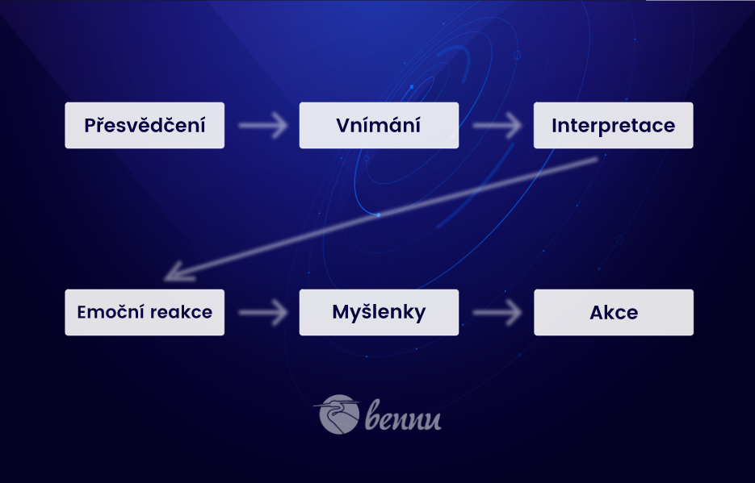

# Ústřední koncepty Bashara

## Jak získat realitu, kterou si přejeme

Rádio nemusí vytvářet program, který si přeje slyšet. Jen se musí naladit na ten, co již existuje. Tím, že se synchronizuje s frekvencemi, činí ze sebe účinný přijímač - podobný ve vibracích onomu signálu - tedy programu, který si přeje přijímat.

Stejně tak vy nemusíte tvořit realitu, kterou si přijete, protože ta již existuje - v rámci nekonečně mnoho pravděpodobných realit, jež existují zároveň vedle sebe. Jediné, co musíte udělat, je stát se efektivní "anténou", s podobnou vibrací, abyste tuto realitu mohli přijmout. Tím se pro vás stane "skutečnou".

1. Nejprve se tou vibrací musíte stát.
2. Pak se automaticky tato realita stává vaší

**Musíte nejprve tuto preferovanou realitu "vidět" jako něco, co již existuje v přítomný okamžik.** Teprve pak se stane hmatatelnou vnější realitou.

Rádio používá tuner stanic pro to, aby bylo možné volit a přijímat jakoukoliv ze stanic - ze všech programů, které simultánně existují všude kolem.

Podobně je tomu u člověka, existuje nekonečně mnoho možných realit, které můžete "přijímat" a zažívat v každý moment. Jak si tedy volíme tu, kterou chceme přitáhnout do své zkušenosti?

**Volíme si a přijímáme specifické "verze" reality podle našich přesvědčení.**

**Volíme si a přijímáme je tím, že 100% věříme tomu, "o čem jsme přesvědčení, že tak jest".**

## Fyzika manifestace, jak to vlastně funguje?

Stejně jako rádio musí nejprve vibrovat na určité frekvenci proto, aby mohlo přijímat jedno konkrétní vysílání (ze všech možných simultánních vysílání), podobně je tomu u člověka.

Vaše přesvědčení způsobují, že vibrujete v rámci unikátního souboru frekvencí. Tyto frekvence potom přitahují svou sympatickou rezonancí hologramy, jež vibrují na té dané frekvenci.

Představte si univerzální matrix, matici nekonečného množství potencionálních hologramů (ze všech nekonečně mnoho možných verzí reality, které existují simultánně), a tyto hologramy a symboly synchronně vibrují na stejných frekvencích jako frekvence vašich přesvědčení. Jsou pak "vytaženy" z tohoto matrixu a "přijaty" vámi jako ony aktuální "externí fyzické zkušenosti". Takové, jež vnímáte jako *skutečné* - jako *objektivní realitu*.

**Každé přesvědčení je tedy unikátní soubor frekvencí, které jako šablona určují, který hologram (*realitu*) si přitáhnete do svojí zkušenosti.**

## Vše je hologram

Každá část hologramu obsahuje informaci k celku - tedy obraz celého programu. Vesmír je strukturován holograficky a i vy jste holografičtí. Stejně tak i každá *verze* vaší reality. Uvnitř sebe máte **všechny** možné verze reality.

Ze všech možných verzí si *volíte* verzi reality dle svých přesvědčení, představivosti a pocitů. Vaše **představivost** je *archívem* všech potencionálních hologramů. Z tohoto archívu možností je aktuální zvolenou realitou ta verze, kterou si *představujete* (věříte v ni nebo na ni soustředíte svou představivost). Následně ji *aktivujete* pomocí svých **pocitů**. 

Čím více jsou tyto pocity **intenzivnější**, tím silněji je tato verze aktivována a **rychleji se manifestuje **do hmotné reality.

Pozitivní pocity a naladění aktivuje žádanou verzi reality. Negativní pocity zase aktivují opak - tedy nežádoucí, obávanou verzi reality.

> Vaše přesvědčení jsou výsledkem vaší **představivosti**, kterou aktivujete svými **pocity**. Ta verze s nejsilnějšími pocity, jež jsou s ní spojeny, je tou verzí, která se aktivuje.

Uveďme si názorný příklad. 

Představte si váš počítač. Ten nabízí mnoho možností a jediné, co musíte udělat, je na jednu z nich kliknout a zvolit si ji. Vaše **představivost** tvoří souhrn všech nabízených možností na vaší obrazovce. Pohyb myší směrem k žádoucí volbě je jako se pomocí představivosti *soustředit* na jednu konkrétní vizi. Kliknutí na onu volbu pak reprezentuje použití vašich **pocitů** - tím aktivujete onen výběr.

## Jak naše přesvědčení formují naší realitu

Většina z vás byla vychována v domnění, že to, co vidíme kolem sebe, je neměnná realita. Od ní se pak odráží vaše přesvědčení. Tvrzení, že "to, co vnímáme, determinuje naší realitu", ale nemůže být dále od pravdy.

Ve skutečnosti tato přesvědčení *o realitě* formují naše vnímání. Nečekejte tedy na zážitek nebo zhmotnění něčeho předtím, než tomu uvěříte. Nejprve tomu uvěřte, teprve pak se tak stane.

1. Vaše **přesvědčení** určují vaší realitu, kterou **vnímáte**. Jak **ji** vnímáte.
2. Ihned na to automaticky (a často podvědomě) toto vaše **vnímání** reality **intepretujete**. Znamená to, že (libovolně) přiřazujete věcem význam, projektujete a někdy až "podsouváte" vašemu **vnímání** reality svůj **výklad**.
3. Následuje **emoční reakce**.
4. Poté si o této realitě něco myslíte - **myšlenky**.
5. Nakonec na základě svých **emocí** a **myšlenek** něco učiníte - reagujete **akcí**.

Když sledujete televizi a aktuální program se vám nelíbí, nesnažíte se jej opravovat nebo transformovat. Místo toho prostě jednoduše "přepnete" na program **jiný**. Program dle **vaší preference**.

Totéž platí o vaší realitě. Pokud se vám nelíbí, nesnažte se ji měnit nebo transformovat. Stačí si **zvolit** jinou verzi reality, kterou chcete *přijmout*. Sladit se s vibrací této *verze* reality, kterou byste rádi zažili. Tato realita již existuje. Jediné, co musíte udělat je, ji *přijmout*. To vy si volíte "kanál", na který se v životě díváte.

> Abyste změnili svět kolem sebe, musíte se změnit uvnitř.

Abych byl přesnější, lidé si svou realitu **"netvoří"**, oni si ji **"zvolí"** a pak ji **"umožní"**, přijmou.

Pro lepší pochopení uveďme analogii:

Stejně jako televize, ani rádio nevytváří program, který vysílá. Prostě si jej "zvolíte" a "umožníte ho".

Jakmile toto pochopíte na úrovni bytí, vědomí, budete mnohem jednodušeji tvořit/volit/umožňovat ty verze reality, které si přejete zažít.

> Realitu, kterou chcete zažít tedy nemusíte tvořit. Již existuje, děje se právě TEĎ - v určité paralelní dimenzi. Jediné, co musíte udělat, je, si ji *vybrat* a umožnit jí *přijít*.

## 3 kroky pro získání té verze reality, kterou preferujeme

### Představte si to (mentální rovina)

Vizualizujte si to. Představte si to. Sněte o tom během dne. Nemusíte si to vizualizovat dlouhou dobu. Krátce stačí, ale musí to být **jasná a zřejmá vizualizace**. Je potřeba mít jasný obraz. Ten pak vytvoří šablonu – představujte si to tedy do podrobných detailů.

**Představte si „to“** a staňte se účinnou psychickou _anténou_ pro přijetí vám preferované reality.

### Naciťte se na to (emocionální rovina)

Nadchněte se a buďte o tom či onom vášniví. Jak byste se cítili, kdybyste to měli NYNÍ? Vciťte se do toho právě teď! Propojte se svou vizí všechny vaše emoce a smysly, jakobyste to měli již nyní! Zahrňte do toho všechny svoje smysly jako dotek, chuť apod.

**Naciťte se na to** a staňte se účinnou emoční _anténou_ pro přijetí vámi preferované reality.

### Staňte se tím (fyzická rovina)

Rozumí se tím fyzická akce. Udělejte to! Uzemníte tím onu zkušenost. Dělejte takové věci, které jsou co nejblíže tomu, co se „vidíte“ dělat ve vašich vizích. Použijte veškeré prostředky na onu simulaci a vyzkoušejte si to _nanečisto_. Tím, že tak učiníte, budete tím trénovat své vědomí. Nasimulujete tím onu „skutečnost“ v přítomný okamžik a Vesmír vám ji následně „doručí“.

Poznámka: fyzická akce není přímou příčinou manifestace. **Místo toho ve vás způsobuje jasnější vibraci a soulad s ní – stáváte se tak lepším přijímačem pro přijetí vámi preferované reality.** Realita, kterou si přejete, již existuje. Nemusíte ji vytvářet. Stačí ji pouze přijmout.

**Staňte se tím** a bude z vás účinná fyzická _anténa_ pro přijetí toho, co si přejete.

Shrnuto,

1. Představte si to -> staňte se účinnou psychickou _anténou_ pro přijetí vám preferované reality.
2. Naciťte se na to -> staňte se účinnou emoční _anténou_ pro přijetí vámi preferované reality.
3. Staňte se tím -> bude z vás účinná fyzická _anténa_ pro přijetí vámi preferované reality.

## Ve skutečnosti *již* máte vše, po čem toužíte

Všechny možné verze reality již existují zároveň a jsou *skutečné*. I vy v sobě už obsahujete VŠE. Máte tedy *k dispozici* cokoli, po čem toužíte nebo byste toužit mohli. Už je to ve vás. Byli jste obdařeni vším, co byste si mohli přát. "Jen" to zatím pro vás nemusí být *viditelné* (respektive reálné).

Stvoření existuje v přítomném okamžiku mimo čas v jeden nekonečný moment - TEĎ. Pokud tedy věříte, že jednoho krásného dne "něco" získáte, věřte, že to již *máte*. Vše totiž existuje NYNÍ ve stavu vidtelnosti či neviditelnosti. 

Záleží na vaší frekvenci (vibraci), která je závislá na vašich **přesvědčeních** o tom, co je reálné.

Není třeba, abyste se modlili nebo si přáli něco **získat.** Je to přímo před vámi. Ve skutečnosti si přejete, abyste byli schopni **vidět**, že je to již ve vaší realitě. Když totiž dokážete *vidět*, že *to* již máte, pak se vaše vibrace **sladí** s vibrací vašeho přání. Jakmile se tak stane, není jiná možnost, než, že se vaše přání zhmotní.

Vše je energie. Takto funguje fyzika v tomto vesmíru - vašemu přání musí být učiněno za dost. Nalaďte se na frekvenci vašeho přání (*pozn. redakce: pocit, jako by bylo již zde*) a uvidíte, že to již bylo "vždy zde", pouze to čekalo na vás, až si toho všimnete a začnete si to užívat.

## 2 techniky pro manifestaci vámi preferované reality

### První technika

1. Mějte jasnou **vizi** nebo **záměr**, jak chcete, aby váš život vypadal.
2. Jelikož existujete, automaticky si tak **zasloužíte** vše, co si přejete.
   - V souladu s tím se ujistěte, že se cítíte této preferované reality **hodni**.
3. Jaká **přesvědčení** by měl člověk, který **již** tuto realitu zažívá?
4. Přijměte tato **přesvědčení** za svá.
5. Pokud nastanou události, které jsou v rozporu s těmito přesvědčeními nebo na povrch vyplují přesvědčení, která jsou v rozporu s těmi nedávno přijatými, pak:
   - Nepředstírejte, že tomu tak není. **Uznejte a přijměte tato oslabující přesvědčení**. (To, co "nevlastníte", nemůžete změnit.)
   - Uvědomte si, že tato oslabující a vámi nově přijatá přesvědčení jsou si **rovna**, shodně platná - a oboje jsou vaší součástí.
   - Na základě tohoto uvědomění si jednoduše zvolte ***vyjádřit*** vámi preferovaná **přesvědčení.**
   - Protože již obsahujete VŠECHNA přesvědčení vůbec, nepotřebujete se "zbavit" těch přesvědčení, po kterých netoužíte. Pouze se ***rozhodněte*** pro ta preferovaná.
6. **Naciťte** se na to, jak by se cítil člověk, který již tuto preferovanou realitu zažívá.
7. **Myslete** jako někdo, kdo již tuto preferovanou realitu žije.
8. **Jednejte** jako někdo, kdo již tuto preferovanou realitu zažívá.

### Druhá technika - "Referenční, preferované Já"

1. Představte si své ideální nebo božské Já, svou nejlepší verzi.
      - Pokud to pro vás bude problém, představte si vaši oblíbenou Božskou bytost.
2. Nyní umístěte toto své "ideální Já" nebo tuto "Božskou bytost" do vámi preferované reality či situace.
3. Pozorujte je, jak zde **jednají**, **cítí** nebo **přemýšlí**.
4. Jednoduše toto chování **kopírujte**:
      - **Pociťujte** to, co v dané situaci v oné preferované realitě ***cítí*** vaše "ideální Já" nebo ona "Božská bytost"
      - **Přemýšlejte** stejně, jako v dané situaci v oné preferované realitě ***přemýšlí*** vaše "ideální Já" nebo ona "Božská bytost"
      - **Jednejte** stejně, jako v dané situaci v oné preferované realitě ***jedná*** vaše "ideální Já" nebo ona "Božská bytost"

Poznámka: Vaše představivost je "most" mezi vámi a vaším Vyšším Já. Tak s vámi promlouvá.

## Jak efektivně vizualizovat to, co si přejeme manifestovat

Fyzická mysl není navržena tak, aby věděla **JAK** se něco zrealizuje nebo, jak to **bude vypadat**, až se tak stane. Můžete *ji* ale využít k rozhodnutí o tom, **CO** si přejete.

Vaše vizualizace je jednoduše symbolickou *reprezentací* **stavu bytí**, jehož cílem je u vás vytvořit **nadšení**. Nemusí se ale manifestovat ve stejné formě, jako ve vaší vizualizaci.

### Krok 1

Vizualizujte si co nejživěji to, co si přejete. Doslova se tím **nadchněte**.

### Krok 2

**PŘEDEJTE** tuto vizualizaci a tento radostný stav bytí svému **Vyššímu Já**.

### Krok 3

Pak ZCELA **zapomeňte** na svou potřebu, aby se vaše přání manifestovalo ve stejné podobě, jako v oné vizualizaci. ("Udržujte si" ale onen radostný stav bytí asociovaný s onou vizualizací)

Řekněme tedy, že jste **nechali** onu vizualizaci **být** a **předali** ji spolu s oním radostným stavem bytí svému **Vyššímu Já**, které rozumí tomu, **JAK** se daná věc může zhmotnit.

Tímto způsobem realizuje manifestaci, která koresponduje s vaším stavem blaženosti, jež jste pocítili, ale ve formě, která výrazně převyšuje původní přání vizualizace. Vaše Vyšší Já tedy dokáže stvořit něco mnohem lepšího, než si lidská mysl dokáže představit - a to výrazně!

Nelimitujte jej tedy tím, že budete trvat na manifestaci vašeho přání přesně tak, jak jste si představovali.

Nezapomeňte tedy - vizualizovat, procítit, "předat" Vyššímu Já a pak opustit potřebu, aby se to manifestovalo ve stejné formě, jako ve vaší představě.

## Přesouvání se mezi paralelními realitami

Existuje nekonečně mnoho verzí reality. Všechny tyto paralelní reality jsou si *rovné*, vy ale v každý moment zažíváte pouze jednu z nich.

Přesun z jedné verze do té další není něco nepřirozeného nebo náročného, činíte tak stejně neustále - miliardkrát za sekundu. Není to tedy o tom, "jak to provést", ale spíše o *nasměrování se* do té paralelní reality, kterou si přejete. Představte si tento přesun mezi realitami jako film, který mění svoje obrázky 24krát za sekundu. Děje se to tak rychle, že to vytváří iluzi hladkého lineárního vývoje.

Když se přesunete do jiné verze reality, stanete se "tím" já, jež zde již existovalo. Předchozí "já" ale nadále existuje a je stále "tam".

Vše je totiž vědomím a vy jste zároveň vším.

> Přesouvání se z jedné paralelní reality do druhé je jako, když "zavřete oči" v jedné verzi a "otevřete je" v té další.

Můžete si to představit jako "pohled skrze okno vašeho dalšího já", místo vašeho starého výhledu.

Pamatujte ale, že toto "nové já" a i to "předchozí" jsou obě platná a stále skutečná. Vždy existovala, protože VY jste VŠÍM. Vaše existence je nekonečná.

"Přepínání" mezi realitami je tedy o **změně perspektivy** či **pohledu** odkud se na danou část VŠEHO, CO JEST, díváte.

Když začnete sami sebe vnímat jako vše, **neztrácíte tím svou identitu**. Naopak, **rozšiřujete** ji o VŠE OSTATNÍ.

## Jak se vypořádat s náročnými situacemi

Nejdříve se ujistěte, že o dané věci přemýšlíte jako o *výzvě* spíše než o *problému*. Problémy už ze samotné definice naznačují, že je obtížné je vyřešit. Navíc právě způsob, jakým si **zvolíte** definovat svou realitu, určuje výsledek dané zkušenosti!

Následně si představte verzi reality, kterou byste chtěli zažívat. Ujistěte se, že jste do ní zahrnuli i sami sebe. Přesněji řečeno, představte si vaše *ideální* já - jak by podle vás vypadalo. Poté jej vsaďte do oné náročné situace ve své představivosti a **sledujte**, jak ji vyřeší.

Pak toto chování prostě **imitujte**!

Zachovejte se stejně, jako toto *ideální já*, když bylo konfrontováno s onou překážkou.

Pamatujte si, že vše, co potřebujete vědět, abyste se stali svým vysněným já, je vám v každý moment přístupné.